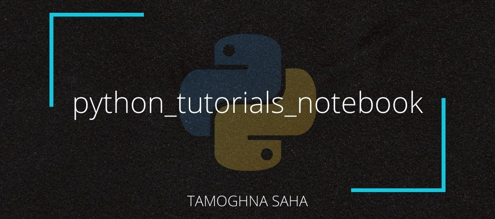
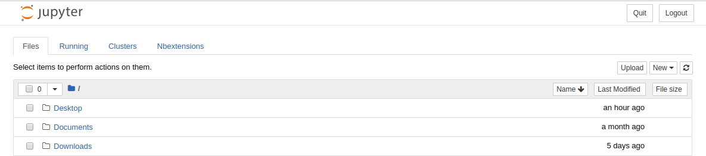

# Python Tutorials Notebook



This repository contains python :snake: notebooks :notebook: for education and data science purposes.

# Contents

__NOTE__: Over the course of time, I will keep on adding more contents in this repo.

## Python

I will be covering the conceptual understanding of Python by dividing it into 3 stages. The contents are as follows:

### Beginner

* What is Python, Why do we need it, Applications
* Numerical and Boolean Operations
* Datatypes and Type Conversion
* Variables and object
* Importing modules
* String, String Operation and String formatting
* Useful pythonic functions (_string_: `join`, `replace`; _numeric_: `max`, `sum`, `abs`)
* User Input
* User Defined Function

### Intermediate

__Part 1__

* Data Structures
  * List, Tuple, Set, Dictionary and its operations
  * List slicing
  * List, set and dictionary comprehension
* Conditional statements, range, loops
* Useful pythonic functions for iterables (`any`, `all`, `enumerate`)

__Part 2__

* File I/O
* Exception Handling
* Lambda
* First-class Function - Map, Filter, Reduce

### Advanced

__Part 1__

* Iterator and Iterables
* Generator
* Class
* Decorator

__Part 2__

* Multithreading & Multiprocessing
* Unit Test Cases

## Libraries for Data Science 101

* Pandas
* NumPy

# Installation

All these installations are performed in __Linux :penguin: (Ubuntu 18.04)__, and I am not providing the same for Windows because, frnakly, coding and development should NOT be done :thumbsdown: in Windows.

There are 2 ways to access Python and its libraries:
* __Approach 1__: Installing Python in admin (`sudo`) level and using `pip` to install libraries
* __Approach 2__: Installing using Poetry

__NOTE__: A good practise while working on multiple projects is to create virtual environments. This can be done in both of the approaches mentioned above.

## Approach 1

### Install Python 3.6

In order to install Python 3.6 on your Ubuntu 18.04 system, you first need to update and upgrade your system to pull the latest available version of Python 3. In your terminal, run the following commands:

```
sudo apt update
sudo apt upgrade -y
```

There are a few more packages and development tools to install using the following command:

```
sudo apt install build-essential libssl-dev libffi-dev python3-dev
```

Once done, you need to install `pip`, which is the official tool that allows you to install Python packages from [__PyPI__](https://pypi.org/), using the following command:

```
sudo apt install -y python3-pip
```

### Install Jupyter Notebook

Run the following command to install Jupyter Notebook:

```
sudo python3 -m pip install ipykernel
sudo python3 -m ipykernel install --user
sudo pip3 install -U jupyter ipython
```

To get the list of available kernels, type:
```
jupyter kernelspec list
```

and you should see an output like this.
```
Available kernels:
python3 /home/info/.local/share/jupyter/kernels/python3
```

Now, this final step is optional. Check if the `kernel.json` file with the correct location pointers to python executable is available or not.

```
cd /usr/local/share/jupyter/kernels/python3/kernel.json
```

If this command fails to execute, then it means that python3 folder was not created for some reason. Now, run these commands:

```
cd /usr/local/share/jupyter/kernels/
sudo mkdir python3
sudo nano kernel.json
```

Once done, place the following location pointers.

```
{
  "display_name": "Python 3",
  "language": "python",
  "argv": [
    "/usr/bin/python3",
    "-m",
    "ipykernel_launcher",
    "-f",
    "{connection_file}"
  ]
}
```

__REQUIRED__: You can install `nbextensions` to get more features in your notebook. You just need to run the following commands to get it done:

```
sudo pip3 install jupyter_contrib_nbextensions
jupyter contrib nbextension install --user
jupyter nbextension enable codefolding/main
```

Now, you need to launch jupyter notebook from the terminal using the following command:

```
jupyter notebook
```

Now, when the tab in your browser opens, you will notice these 4 tabs (considering everything worked perfectly):



You can see that `Nbextension` is also appearing. Click on that tab and select the following _recommended_ extensions:

* `Highlight selected word`
* `Table of Contents 2`
* `ExecuteTime`
* `table_beautifier`
* `spellchecker`

## Approach 2

First, you need to install __Poetry__ in your system. Follow the instruction from [here](https://python-poetry.org/docs/#installation).

Once you clone this repo, perform the following commands:

```
cd python_tutorial_notebook
poetry shell
poetry install
```

This will create a virtual environment and install all the relevant packages listed in `pyproject.toml`. If you wish to add additional packages, mention in the toml file with version and you then execute

```
poetry update
```

so that the new packages gets reflected in the virtual environment.

:tada: Voila, ladies and gentlemen. Now, start coding!