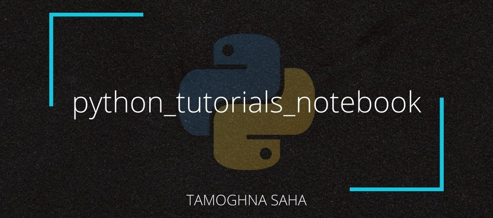

# Python Tutorials Notebook



This repository contains python :snake: notebooks :notebook: for education and data science purposes.

# Contents

In this series, I have covered the conceptual understanding of Python by dividing it into 3 stages, the loop holes that you need to watch out, and assignments to get your hands dirty.

The contents covered in each of these Python Notebooks are as follows:

__NOTE__: Over the course of time, I will keep on adding more contents in this repo.

## Beginner

* What is Python, Why do we need it, Applications
* Numerical and Boolean Operations
* Datatypes and Type Conversion
* Variables and object
* Importing modules
* String, String Operation and String formatting
* Useful pythonic functions (_string_: `join`, `replace`; _numeric_: `max`, `sum`, `abs`)
* User Input
* User Defined Function

## Intermediate

__Part 1__

* Data Structures
  * List, Tuple, Set, Dictionary and its operations
  * List slicing
  * List and dictionary comprehension
* Conditional statements, range, loops
* File I/O

__Part 2__

* Class, Inheritance
* Exception Handling
* Lambda
* First-class Function - Map & Filter
* Iterators, generators
* Useful pythonic functions for iterables (any, enumerate)


## Advanced

* Pandas
* NumPy

# Installation

All these installations are performed in __Ubuntu 18.04__, and I am not providing the same for Windows because, frnakly, coding and development should not be done :thumbsdown: in Windows.

## Install Python 3.6

In order to install Python 3.6 on your Ubuntu 18.04 system, you first need to update and upgrade your system to pull the latest available version of Python 3. In your terminal, run the following commands:

```
sudo apt update
sudo apt upgrade -y
```

There are a few more packages and development tools to install using the following command:

```
sudo apt install build-essential libssl-dev libffi-dev python3-dev
```

Once done, you need to install `pip`, which is the official tool that allows you to install Python packages from [__PyPI__](https://pypi.org/), using the following command:

```
sudo apt install -y python3-pip
```

## Install Jupyter Notebook

Run the following command to install Jupyter Notebook:

```
sudo python3 -m pip install ipykernel
sudo python3 -m ipykernel install --user
sudo pip3 install -U jupyter ipython
```

To get the list of available kernels, type:
```
jupyter kernelspec list
```

and you should see an output like this.
```
Available kernels:
python3 /home/info/.local/share/jupyter/kernels/python3
```

Now, this final step is optional. Check if the `kernel.json` file with the correct location pointers to python executable is available or not.

```
cd /usr/local/share/jupyter/kernels/python3/kernel.json
```

If this command fails to execute, then it means that python3 folder was not created for some reason. Now, run these commands:

```
cd /usr/local/share/jupyter/kernels/
sudo mkdir python3
sudo nano kernel.json
```

Once done, place the following location pointers.

```
{
  "display_name": "Python 3",
  "language": "python",
  "argv": [
    "/usr/bin/python3",
    "-m",
    "ipykernel_launcher",
    "-f",
    "{connection_file}"
  ]
}
```

__BONUS__ : You can install `nbextensions` to get more features in your notebook. You just need to run the following commands to get it done:

```
sudo pip3 install jupyter_contrib_nbextensions
jupyter contrib nbextension install --user
jupyter nbextension enable codefolding/main
```

Now, you need to launch jupyter notebook from the terminal using the following command:

```
jupyter notebook
```

Now, when the tab in your browser opens, you will notice these 4 tabs (considering everything worked perfectly):


You can see that `Nbextension` is also appearing. Click on that tab and select the following _recommended_ extensions:

* `Highlight selected word`
* `Table of Contents 2`
* `ExecuteTime`
* `table_beautifier`
* `spellchecker`

:tada: Voila, ladies and gentlemen. Now, start coding!